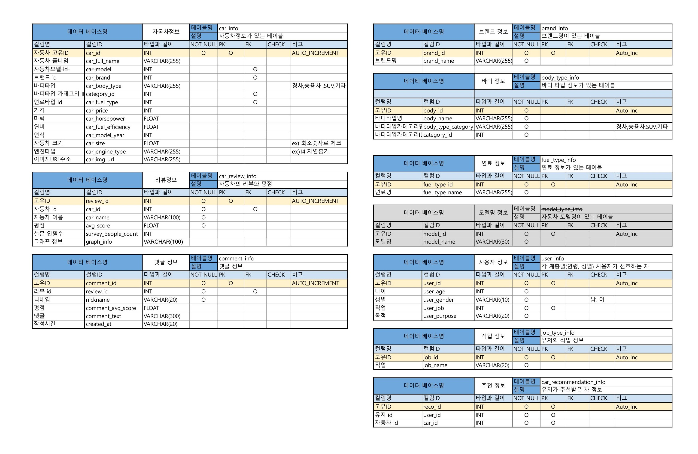
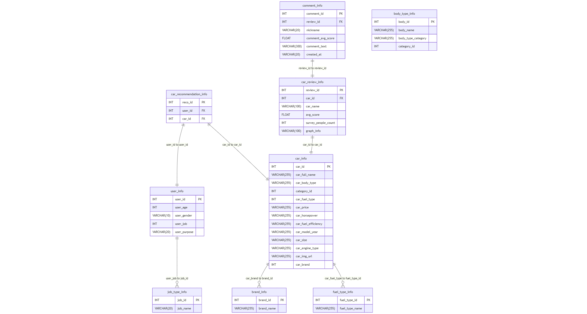
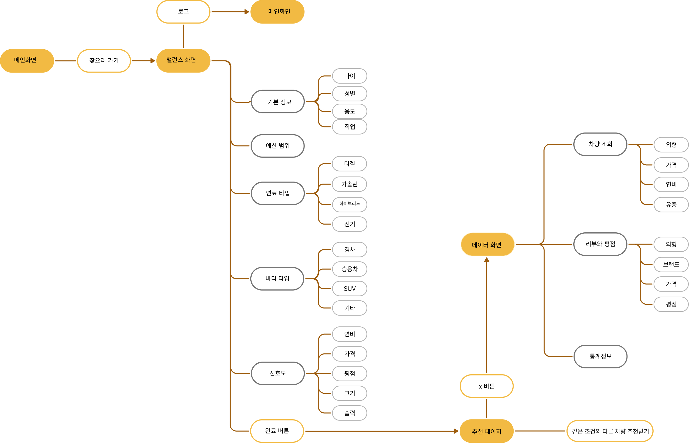
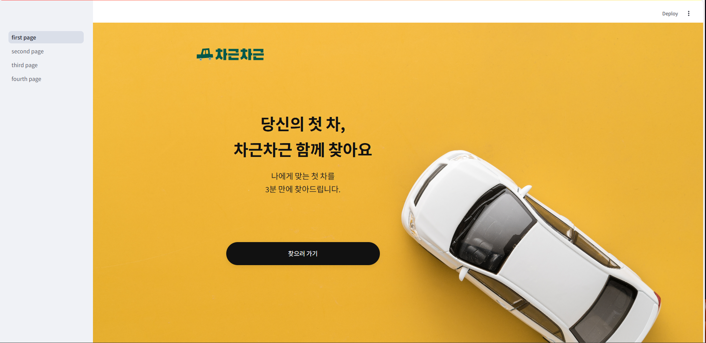
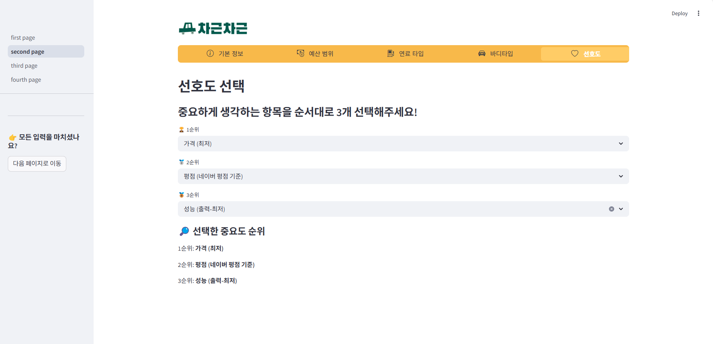
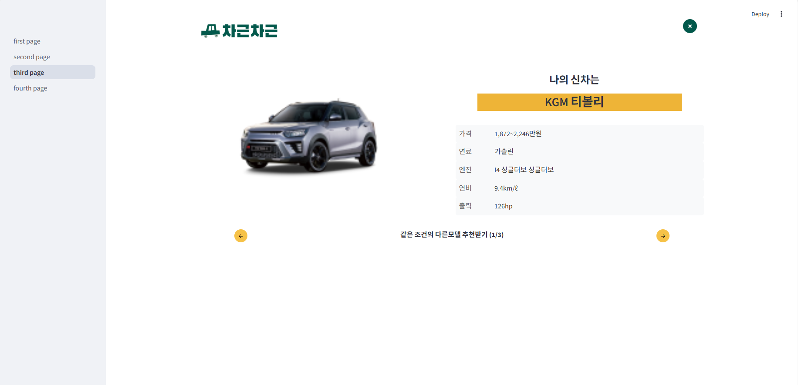
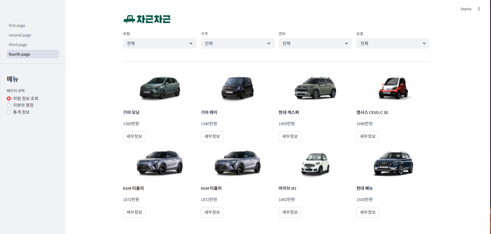
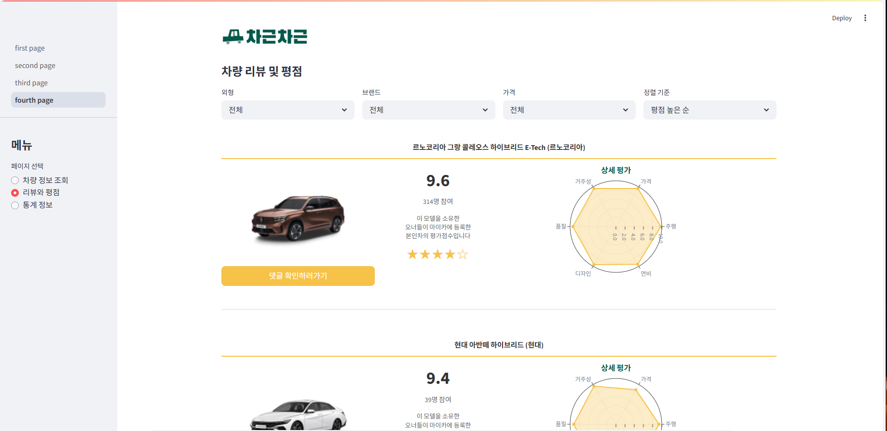
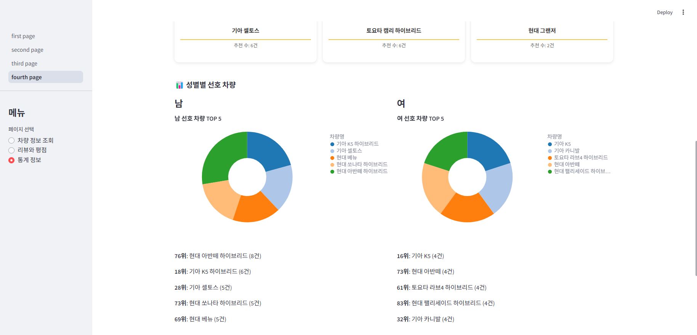

# SKN14-1st-2 Team

- SK 네트웍스 AI Camp 1차 프로젝트

---

## 👥 팀원 소개

<table border="1" style="border-collapse: collapse; text-align: center;">
  <thead>
    <tr>
      <th style="padding: 10px;">캐릭터</th>
      <th style="padding: 10px;">이름</th>
      <th style="padding: 10px;">역할</th>
      <th style="padding: 10px;">담당 업무</th>
    </tr>
  </thead>
  <tbody>
    <tr>
      <td></td>
      <td>김의령</td>
      <td>프론트엔드, 백엔드</td>
      <td>리뷰데이터 수집 및 DB 생성, 피그마 페이지 설계 및 streamlit 세부 UI 수정</td>
    </tr>
    <tr>
      <td></td>
      <td>김준기</td>
      <td>프론트엔드, 백엔드</td>
      <td>발표 및 팀원들 오류 해결</td>
    </tr>
    <tr>
      <td></td>
      <td>윤이서</td>
      <td>백엔드</td>
      <td>데이터 스크래핑 및 자동차정보 DB 생성</td>
    </tr>
    <tr>
      <td></td>
      <td>조성렬</td>
      <td>프론트엔드</td>
      <td>streamlit 구현 및 README 작성</td>
    </tr>
    <tr>
      <td></td>
      <td>한성규</td>
      <td>프론트엔드</td>
      <td>streamlit 구현</td>
    </tr>
  </tbody>
</table>

---

# 1. 프로젝트 개요

## 1-1. 주제 및 프로젝트 소개

### 🚗 당신의 첫 차, 차근차근 함께 찾아요

✅ 이 웹 애플리케이션은 **사회초년생(첫 직장인/취업 준비생 등)** 을 위한 자동차 추천 서비스를 제공합니다.  
**경제성, 실용성, 유지비 등**을 기준으로 차량을 추천받을 수 있습니다.

## 1-2. 프로젝트 목적 (필요성 및 배경)

**"차근차근"** 은 사회에 첫발을 내딛는 초년생들이 합리적이고 신중한 첫 차량 구매 결정을 내릴 수 있도록 지원하는 것을 목표로 합니다.

차량 구매는 개인의 라이프스타일, 재정 상황, 이동 패턴 등 다양한 요소와 밀접하게 연결된 중요한 선택입니다. 그러나 사회초년생들은 정보 부족과 구매 경험 부족으로 인해 선택 과정에서 어려움을 겪기 쉽습니다.

이에 본 프로그램은 초년생들의 경제적 현실을 고려하여 주요 예산 범위를 **1,000만 원에서 5,000만 원**으로 설정했습니다. 이 범위는 초기 구매 부담을 낮추면서도 다양한 선택지를 제공하기 위한 것으로, 초년생들의 합리적 소비를 적극 지원하고자 합니다.

또한 단순한 차량 스펙 비교를 넘어, **예산**, **사용 목적**, **선호 조건** 등을 종합적으로 반영한 **맞춤형 차량 추천 서비스**를 제공합니다. 이를 통해 사회초년생들이 시행착오를 줄이고, 자신에게 가장 적합한 차량을 효율적으로 선택할 수 있도록 돕는 것을 지향합니다.

궁극적으로 본 프로젝트는 사회초년생들이 책임감 있는 소비자로 성장할 수 있도록 지원하고, 삶의 질 향상과 안정적인 사회 정착에 기여하는 것을 최종 목적으로 삼고 있습니다.

---

# 2. 🖥️ 프로젝트

## 2-1. 📌 주요 기능

- ✅ 예산, 용도, 선호도, 기능 기반 자동차 추천  
- ✅ 다양한 필터 옵션 (가격, 브랜드, 크기, 연비 등)  
- ✅ 차량 상세 정보 제공 (네이버 자동차 데이터 사용)  
- ✅ Streamlit 기반의 직관적인 웹 인터페이스 제공

## 2-2. 🛠️ 기술 스택

| 분류 | 기술도구 |
|-----|--------|
| 언어 |  |
| 데이터스크래핑 | ,|
| 데이터베이스 |  |
| 웹 |  |
| 협업 툴 | ,,, |

## 2-3. 📝 요구사항 명세서

### 사용자 관련
- 사용자는 예산범위, 사용용도 등을 기반으로 자동차 추천을 받을 수 있다.
- 사용자의 정보는 `사용자 정보` 테이블에 저장된다.
- 사용자의 직업은 `직업 타입 정보` 테이블을 참조한다.

### 추천 시스템
- 추천 결과는 `차 추천 정보` 테이블에 저장된다.
- 추천은 `사용자`와 `자동차` 의 매칭으로 기록된다.

### 자동차 정보 관리
- 자동차 기본 정보는 `자동차 정보` 테이블에 저장된다.
- 자동차 정보에는 브랜드, 연료 종류, 차종 등의 세부 항목이 포함된다.
- 자동차 브랜드는 `브랜드 정보` 테이블을 참조한다.
- 연료 종류는 `연료 타입 정보` 테이블을 참조한다.
- 차종(바디 타입)은 `바디 타입 정보` 테이블을 참조한다.

### 자동차 평점 관리
- 각 자동차에 대한 리뷰는 `차 리뷰 정보` 테이블에 저장된다.
- 평점 관리에는 `평균 점수`, `설문 참여자 수` 등이 포함된다.

### 댓글 기능
- 댓글 데이터는 `댓글 정보` 테이블에 저장되며, 닉네임과 점수, 작성 일자 등이 포함된다.

## 2-4. 🗃️ 테이블 정의서

## 2-5. 🧩 ERD

## 2-6. 📊 플로우차트 (FlowChart)

---

# 3. 💡 사용 방법

### streamlit 링크:https://youtu.be/I3xvUR2EuGQ?feature=shared

---

## 🟢 first page: **메인화면** (찾으러가기)
> 사용자가 앱의 시작점에서 추천을 받기 위해 이동  

---

## 🟡 second page: **밸런스 화면** (기본정보, 예산, 연료, 바디, 선호도)
> 나에게 맞는 조건을 설정하여 차량 추천의 기준을 구성  

---

## 🔵 third page: **추천 페이지**
> 설정한 조건에 따라 적합한 차량을 추천  

---

## 🟣 fourth page: **데이터 화면** (차량조회, 리뷰와 평점, 통계정보)
> 다양한 차량에 대한 정보, 리뷰, 평점, 통계를 확인할 수 있음  

- 📋 차량 정보 조회  
- 🌟 리뷰와 평점  
- 📊 통계 정보  

  
  

# 4. 🕊️ 회고

- **김의령**: 이번 단위 프로젝트를 통해 지금까지 배운 내용을 다시 활용하며 실력이 한층 성장했다고 느꼈습니다.
2일이라는 짧은 시간 동안 원하는 만큼 기능을 구현하는 것은 쉽지 않을 거라 생각했지만, 최선을 다한 팀원들 덕분에 원했던 기능들을 어느 정도 구현하고, 시간 안에 프로젝트를 완성할 수 있었습니다. 뿌듯 -!

- **김준기**: 열정적이고 적극적인 팀원들 덕분에 프로젝트가 무사히 마무리 되었다고 생각합니다.또한 차량정보에 대해 알게 된 좋은 계기가 된 것 같습니다.

- **윤이서**: 짧은 기간에도 적극적으로 참여해준 팀원들 덕분에 완성도 높은 결과물이 나올 수 있었습니다! 잠까지 포기하며 모든 영역에서 하드캐리해준 의령님, 제일 어려운 스트림릿 구현에 애써주신 성렬님, 성규님, 오류 해결에 도움주신 준기님 고맙습니다 💛🤍💛🤍

- **조성렬**: 프로젝트를 하며 팀원들과 좋은 의견들을 나누고 협의했던 과정이 가장 기억에 납니다. 물론 프론트엔드 업무를 처음 하게 되어 걱정도 되었고 많은 장애요소를 겪고 해결하는 과정의 반복이였지만 이번 경험을 토대로 다음 프로젝트에서는 더 성장해 있을거라고 생각합니다.

- **한성규**: 프로젝트 내내 수많은 에러들을 겪으며 성장한 것 같습니다.혼자였다면 진행하기 어려웠을 프로젝트를 팀원들과 함께한 덕에 마무리 할 수 있었던 것 같습니다.
얼마나 부족한지 다시 한번 느꼈고, 앞으로 더 열심히 공부하겠습니다~🥲

---

# 5. ☑️ 피드백

- 코드 중복을 지우는 리펙토링이 필요할 것 같습니다.
- 주제선정 과정에서 우선순위를 세밀하게 살폈다면 진행과정이 좀 더 매끄러웠을 것 같습니다.
- 처음 디자인 했던 기능을 모두 구현하지 못해 아쉬운 부분이 있습니다.

---